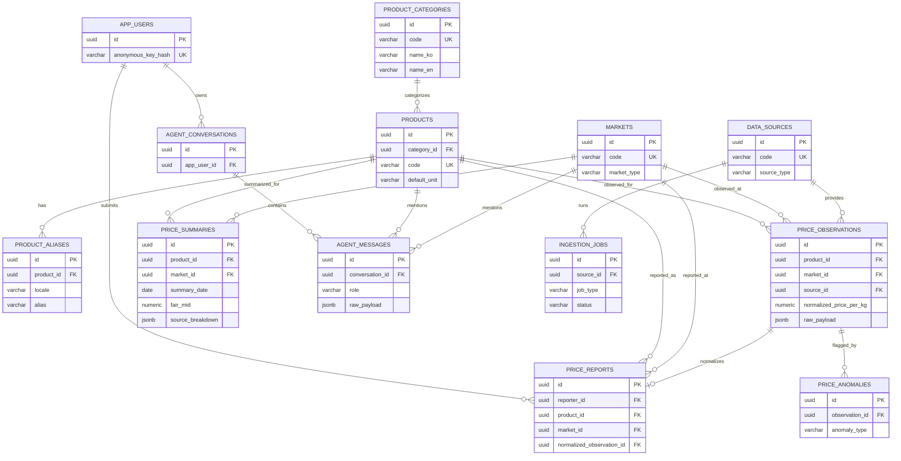

# BozorCheck Database ERD

## Core Flow

- Master data defines products, markets, and data sources.
- User submitted prices are stored in `price_reports` first.
- Reviewed and normalized prices are stored in `price_observations`.
- Read-optimized fair price bands are stored in `price_summaries`.
- Future Dify chat logs can be stored in `agent_conversations` and `agent_messages` without adding API integration in this phase.
